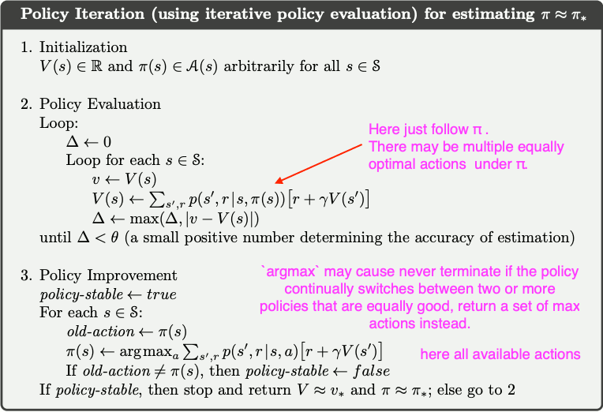
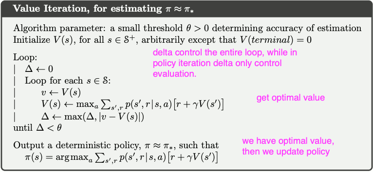
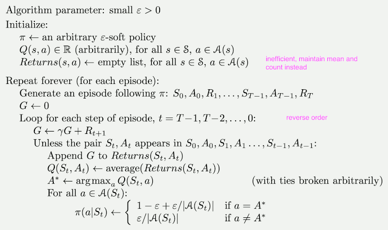
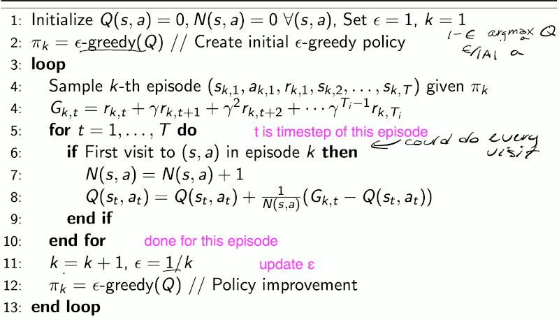
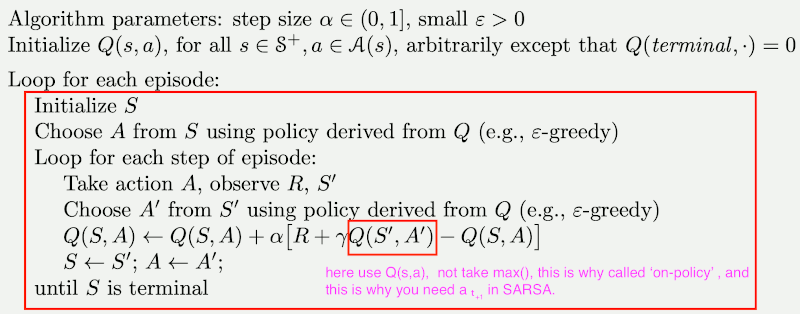
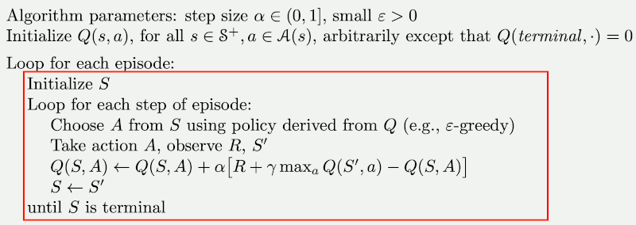
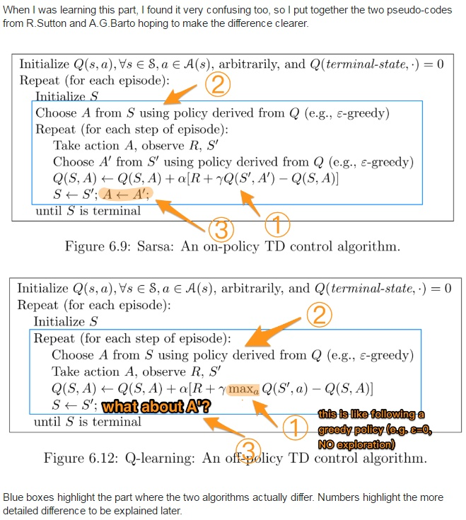
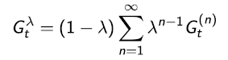
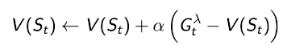

# S.Sutton  Reinforcement Learning: An Introduction

http://incompleteideas.net/book/

http://incompleteideas.net/book/solutions-2nd.html

Recommend :

- Covering Chapter 1 for a brief overview.
- Chapter 2 through Section 2.4, Chapter 3, and then selecting sections from the remaining chapters according to time and interests.
- Chapter 6 is the most important for the subject and for the rest of the book.
- artificial intelligence or planning :  Chapter 8
- machine learning or neural networks :  Chapter 9, 10

marked as `*` :  more difficult and not essential to the rest of the book.  These can be omitted on 1st reading. 

## Chapter 1. Introduction 

[Introduction](book/Introduction.pdf)

- key features
    - trial-and-error search 
    - delayed reward
    - considers the *whole* problem of a goal-directed agent interacting with an uncertain environment.
- trade-off between exploration and exploitation ( for methods those need episodes sampling )
- 4 main subelements
    1. policy
    2. reward signal
        - immediate desirability of state
        - sole objective of RL is to maximize the total reward
    3. value function
        - value indicate the long-term desirability of states
    4. (optionally) model of the environment.
        - model-based methods: use models and *planning*
        - model-free methods: trial-and-error
- play Tic-Tac-Toe against an imperfect player
    - minimax is not correct here
    - dynamic programming requires a complete model, need playing many games to build from experience (this is not that different from some of the reinforcement learning methods).
- reinforcement learning can also be applied 
    - when part of the state is hidden,
    - or to continuous-time problems as well, 
    - model is not required, but models can easily be used,
        - without re-building the workd model from experience, we can directly improve the policy by learning the Q-value
    - at both high and low levels in a system.
- The use of value functions distinguishes reinforcement learning methods from evolutionary methods.

# Part I: Tabular Solution Methods

[Part I](book/Part%20I%20Tabular%20Solution%20Methods/Part%20I.pdf)

The simplest RL forms: the approximate value functions to be represented as *arrays*, or *tables* , and can ofen find *exact solution*, while general RL can only find approximate solutions. 

- bandit problem
    - only a single state
- MDP, 3 fundamental mothods to solve MDP:
    - dynamic programming
        - well developed mathematically
        - but require a complete and accurate model of the environment
    - Monte Carlo methods
        - don’t require a model and are conceptually simple
        - but are not well suited for step-by-step incremental computation.
        - *MC can also be applied to non-Markov problem*
    - temporal-difference learning 
        - require no model and are fully incremental
        - but are more complex to analyze.
- combining those 3 methods to solve MDP

## Chapter 2. Multi-armed Bandits

[Chapter 2](book/Part%20I%20Tabular%20Solution%20Methods/02.%20Multi-armed%20Bandits.pdf)

- k-armed Bandit Problem
- balancing exploration and exploitation
    1. ε-greedy methods
        - choose actions randomly a small fraction of the time
            - tie breaking on greedy *argmax*
        - small ε improved more slowly, but eventually would perform better 
        - estimate action values
            - averaging methods (for stationary problem) ,  special const step-size method, with α = 1/n
            - const step-size method (for nonstationary problem)
    2. UCB
        - different on **exploration** 
        - not pratical in general RL problem.
    3. Gradient Bandit Algorithms
        - estimate not action values, but action preferences
        - learning a numerical *preference* for each action  Ht(a).
        - [soft-max](https://github.com/mebusy/notes/blob/master/dev_notes/softmax.md) distribution
- optimistic initial values
    - encourage exploration, but is effective only on stationary problems
    - may use *Unbiased Constant-Step-Size Trick* to utilize initial value in nonstationary problem.

## Chapter 3. Finite Markov Decision Processes

[Chapter 3](book/Part%20I%20Tabular%20Solution%20Methods/03%20Finite%20MDP.pdf)

[cs234 Lecture 2: Making Sequences of Good Decisions Given a Model of the World](https://nbviewer.org/github/mebusy/cs234_RL_2019_stanford/blob/main/lecture/lecture2.pdf)

- Markov Property
    - State st is Markov iff:
        - p( st+1 | st, at ) = p( st+1 | ht, at ) 
    - Future is independent of past given present
- Markov Reward Process (MRP)
    - Markov Chain + rewards
    - MRP problem can be solved directly by matrix
        - V = R + γPV
        - **V = ( I - γP )-1R**
    - or use an Iterative Algorithm
- Markov Decision Process (MDP)
    - MDP = MRP + actions
    - **MRP = MDP + policy**
        - Implies we can use same techniques to evaluate the value of a policy for a MDP as we could to compute the value of a MRP,
        - by defining a MRP with Rπ, Pπ

---

- 3.2 Goals and Rewards
    - It is thus critical that the rewards we set up truly indicate what we want accomplished.
        - In particular, the reward signal is not the place to impart to the agent prior knowledge about how to achieve what we want it to do.
        - For example, a chess-playing agent should be rewarded only for actually winning, not for achieving subgoals such as taking its opponent’s pieces or gaining control of the center of the board.
        - The reward signal is your way of communicating to the robot **what** you want it to achieve, not **how** you want it achieved
- 3.3 Returns and Episodes
    - *episode*: the agent–environment interaction breaks naturally into subsequences, which we call episodes.
    - *episodic tasks*: Tasks with episodes of this kind are called episodic tasks.
    - *continuing tasks*: In many cases the agent–environment interaction does not break naturally into identifiable episodes, but goes on continually without limit.
        - the final time step would be T = ∞, and the return could itself easily be infinite.
        - Solution: discounted rewards
    - Example: Pole-Balancing
        - This task could be treated as episodic. The reward in this case could be +1 for every time step on which failure did not occur.
        - Alternatively, we could treat pole-balancing as a continuing task, using discounting. In this case the reward would be -1 on each failure and zero at all other times.
- 3.5 Policies and Value Functions
    - state-value function / action-value function
    - The *value* of a *state* is the expected sum of all future rewards when starting in that **state** and following a specific policy.
        - **Note that the value of the terminal state, if any, is always zero.**
            - by the definition, the value of a state v(s) is the expected sum (perhaps discounted) of rewards from all future time steps. There are no future time steps when in a terminal state, so this sum must be zero.
        - you may get reward when you entering the terminal state; but then you take any action the whole episode terminated. 
    - The value functions vπ and qπ can be estimated from experience.
        - We call estimation methods of this kind *Monte Carlo methods* because they involve averaging over many random samples of actual returns.
- 3.6 Optimal Policies and Optimal Value Functions
    - Explicitly solving the Bellman optimality equation is **rarely** directly useful. This solution relies on at least three assumptions that are rarely true in practice: 
        1. know the exact MDP
        2. have enough computational resources
        3. the Markov property
    - We consider a variety of such methods in the following chapters.

Why discount?

Most Markov reward and decision processes are discounted. Why?

- Mathematically convenient to discount rewards
- Avoids infinit returns in cyclic Markov processes
- Uncertainty about the future may not be fully represented
    - we might NOT have a prefect model. 
- If the reward is financial,  immediate rewards may earn more interest than delayed rewards
- Animal/human behaviour shows preference for immediate reward
- It is sometimes possible to use *undiscounted* Markov reward processes (i.e. γ=1), e.g. if all sequences terminate

## Chapter 4. Dynamic Programming

[Chapter 4](book/Part%20I%20Tabular%20Solution%20Methods/04%20Dynamic%20Programming.pdf)

- Classical DP algorithms are of limited utility in reinforcement learning
    - both because of their assumption of a perfect model and because of their great computational expense.
- DP provides an essential foundation for the understanding of the methods presented in the rest of this book.
    - In fact, all of these methods can be viewed as attempts to achieve much the same effect as DP, only with less computation and without assuming a perfect model of the environment.
- We usually assume that the environment is a finite MDP, although DP ideas can be applied to problems with continuous state and action spaces, exact solutions are possible only in special cases. 
    - a common way is to quantize the state and action spaces and then apply finite-state DP methods
- Two most popular DP methods
    - 4.3 Policy Iteration
        - Policy Evaluation + Policy Improvement
        - *policy evaluation*: compute the state-value function vπ for an arbitrary policy π. (until converge)
        - using the value function for a policy to help find better policies.
        - 
        - [example source](exercise/exer4/policyIteration.py)
    - 4.4 Value Iteration
        - 
        - [example source](exercise/exer4/valueIteration.py)

---

- Generalized Policy Iteration
    - Does policy evaluation need to converge to vπ?  No.
    - Or shoud we introduce a stopping condition 
        - e.g. ε-convergence of value function
    - Or simply stop after *k* iterations of iterative policy evaluation ?
        - for example, in the small gridworld, k=3 was sufficient to achieve optimal policy.
    - Why not update policy every iteration?  i.e. stop after k=1
        - **This is equivalent to value iteration**
- Policy Evaluation/Iteration , Value Iteration could also apply to action-value function q(s,a)
    - But the complexity will increase to O(m²n²) while value function is O(mn²),  for m actions, n stats
- 3 simple ideas for asynchronous dynamic programming
    1. in-place dynamic programming
        - synchronous value iteration stores 2 copies of value function ,  vnew(s) ← vold(s') , vold ← vnew
        - in-place value iteration only stores one copy value function  v(s)← v(s'), the ordering of status updating really matters, and that motivates **Prioritised sweeping**
    2. Prioritised sweeping
        - use magnitude of Bellman error to guide state selection, e.g. the states which changes most
    3. Real-time dynamic programming
        - Idea: only states that are relevant to agent.

## Chapter 5 Monte Carlo Methods

[Chapter 5](book/Part%20I%20Tabular%20Solution%20Methods/05%20Monte%20Carlo%20Methods.pdf)

- **estimating** value functions, **not assume** complete knowledge of the environment, based on averaging **complete** returns (as opposed to methods that learn from partial returns).
- Monte Carlo methods require only *experience*
    - Learning from *actual* experience requires no prior knowledge of the environment’s dynamics.
    - Learning from *simulated* experience, a model is required, the model need only generate sample transitions, not the complete probability distributions.
        - e.g. Blackjack. 
- 5.1 Prediction
    - *first-visit* MC method  /  **every-visit** MC method
- 5.2 Monte Carlo Estimation of Action Values
    - If a model is not available, state-value alone is not sufficient to determine a policy.
    - The only complication is that many state–action pairs may never be visited. For policy evaluation to work for action values, we must assure continual exploration.
- 5.3 Monte Carlo Control
- 5.4 Monte Carlo Control without Exploring Starts
    - **On-policy first-visit MC control** (for ε-soft policies)
        - from book
            - 
        - from cs234
            - 
- 5.5 Off-policy Prediction via Importance Sampling
- Advantage than DP
    1. with no model of the environment’s dynamic
    2. can be used with simulation or *sample models*
    3. the estimates for each state are independent
        - can evaluate a single state without forming estimates for any other states. 

----------

- Q value
    - With a model, state values alone are sufficient to determine a policy
        - one simply looks ahead one step and chooses the optimal action 
    - Without a model, however, state values alone are not sufficient. 
        - One must explicitly estimate the value of each action in order for the values to be useful in suggesting a policy. 

<b>On-Policy VS Off-Policy</b>

- on-policy
    - learn from DIRECT experience obtained from following that policy
- off-policy: learning is from data **off** the target policy
    - learn by using experience gathered from following a different policy
    - we can combine experience for trying out different things to try to learn about something we didn’t do by itself.
    - Imagine you have a case  where there’s only a single state for now. 
        - You experienced s1,a1,s1,a2; and s1,a2,s1,a2.
        - So you’d like to be able to kind of combine between these experiences so you could learn about doing this: s1,a1,s1,a2, even though you’ve never done that in the world.

## Chapter 6 Temporal-Difference Learning

[Chapter 6](book/Part%20I%20Tabular%20Solution%20Methods/06%20TD-Learning.pdf)

[cs234 Lecture 3: Model-Free Policy Evaluation](https://nbviewer.org/github/mebusy/cs234_RL_2019_stanford/blob/main/lecture/lecture3.pdf)

[cs234 Lecture 4: Model-Free Control](https://nbviewer.org/github/mebusy/cs234_RL_2019_stanford/blob/main/lecture/Lecture%204.pdf)

- TD learning is a combination of Monte Carlo ideas and dynamic programming (DP) ideas
    - can learn directly from raw experience without a model
        - using a **sample** of st+1 to approximate an expectation
    - update estimates based on other learned estimates
        - bootstrapping, uses estimate of V( st+1 )
- 6.1 TD Prediction
    - *bootstrapping* method
        - update base on existing estimate
    - TD(0), or *one-step* TD, update state-value only until the next time step
- 6.2 Advantages of TD Prediction Methods
    - do not require a model of the environment, of its R and P  ( over DP)
    - are naturally implemented in an online, fully incremental fashion ( over MC )
        - some applications have very long episodes, other applications are continuing tasks and have no episodes at all
- 6.4 Sarsa: On-policy TD Control
    - 
- 6.5 Q-learning: Off-policy TD Control
    - 
- 6.6 Expected Sarsa
    - when updating Q value, use expected value instead of max ( compare with Q-learning )
- 6.7 Maximization Bias and Double Learning

<b>When are Monte Carlo methods preferred over temporal difference ones?</b>

- main difference
    - TD-learning uses bootstrapping to approximate the action-value function
    - Monte Carlo uses an average to accomplish this
- The main problem with TD learning and DP is that their step updates are biased on the initial conditions of the learning parameters. 
    - However, the bias can cause significant problems, especially for off-policy methods (e.g. Q Learning) and when using function approximators. That combination is so likely to fail to converge that it is called the **deadly triad** in Sutton & Barto.
- Monte Carlo control methods do not suffer from this bias, as each update is made using a true sample of what Q(s,a) should be. However, Monte Carlo methods can suffer from high variance, which means more samples are required to achieve the same degree of learning compared to TD.
- If you are using a value-based method (as opposed to a policy-based one), then TD learning is generally used more in practice, or a TD/MC combination method such as TD(λ) can be even better. 
    - Monte Carlo learning is conceptually simple, robust and easy to implement. I would generally not use it for a learning controller engine (unless in a hurry to implement something for a simple environment), but I would seriously consider it for policy evaluation in order to compare multiple agents for instance.

TD VS. MC

TD | MC
--- | --- 
learn online after every step | must wait until end of episode before return is known
can learn from incomplete sequences | can only learn from complete sequences
works in continuing (non-terminating) environments | only works for episodic (terminating) environments
has low variance, some bias | has high variance, zero bias
TD exploits Markov property,Usually more efficient in Markov environments | MC does not exploit Markov property,Usually more effective in non-Markov environments

<b>SARSA vs Q-Learning</b>

- SARSA is a on-policy algorithm, while Q-Learning is off-policy
- The most important difference is how Q is updated after each action.
    - 
    - SARSA uses the Q' following a ε-greedy policy exactly as A' is drawn from it.
    - Q-learning uses the maximum Q' over all possible actions for the next step. This makes it look like following a greedy policy.

· | SARSA | Q-learning
--- | --- | --- 
choosing A' | π | π
updating Q | π | μ

where π is ε-greedy policy , and μ is a greedy policy

TD-Learning vs Q-Learning

- Temporal Difference is an approach to learning how to predict a quantity that depends on future values of a given signal. 
- It can be used to learn both the V-function and the Q-function, whereas Q-learning is a specific TD algorithm used to learn the Q-function.
- You need the Q-function to perform an action (e.g., following an epsilon-greedy policy). If you have only the V-function you can still derive the Q-function by iterating over all the possible next states and choosing the action which leads you to the state with the highest V-value.

Bootstrapping and Sampling, MC,DP,TD

 · | Bootstrapping  |  Sampling
 --- | --- | ---
 · | do not actually use the real returns, use estimated value instead | use samples, not full-width backup
 MC | dost not bootstrap  estimates for each state are independent  |  samples (deep backups)
 DP | bootstraps  |  does not sample (shallow backups)
 TD | bootstraps  | samples (shallow backups)

## Chapter 7 n-step Bootstrapping

[Chapter 7](book/Part%20I%20Tabular%20Solution%20Methods/07-n-step-Bootstrapping.pdf)

- TD(λ)
    - The λ-return Gₜλ combines all n-step returns Gₜⁿ
    - Using weight (1-λ)λn-1
        - 
    - Forward-view TD(λ)
        - 
- Question: why use a geometric weighting ?
    - it makes an efficiently computable algorithm.
    - geometric weighting is memoryless. That means we can do the computation in a very efficient way. It does not require either storing or computing something different for each of your n-step returns.
    - You can do TD(λ) for the same cost of TD(0)

## Chapter 8 Planning and Learning with Tabular Methods

[Chapter 8](book/Part%20I%20Tabular%20Solution%20Methods/08-planning-learning-with-Tabular-Methods.pdf)

- 8.1 Models and Planning
    - model
        - distribution model ( e.g. models used in DP)
        - sample model ( e.g. model used in the blackjack exampl )
    - model -> *planning* -> policy
- 8.2 Dyna: Integrated Planning, Acting, and Learning

