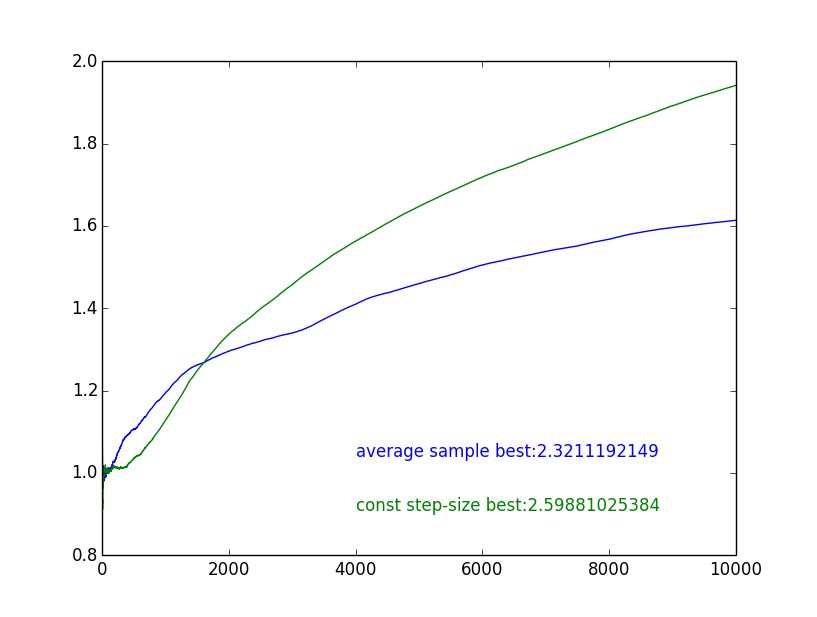

# Exercise of Chapter 2

- Exercise 2.1 
    - Q: In "ε-greedy action selection, for the case of two actions and ε = 0.5, what is the probability that the greedy action is selected?
    - A: *`(1-0.5) + (0.5/N)  > 0.5`*,  where N is the length of action space.

- Exercise 2.2  *Bandit example*
    - Q: Consider a k-armed bandit problem with k = 4 actions, denoted 1, 2, 3, and 4. Consider applying to this problem a bandit algorithm using ε-greedy action selection, sample-average action-value estimates, and initial estimates of Q₁(a) = 0, for all a. Suppose the initial sequence of actions and rewards is A₁ = 1, R₁ =-1,A₂ =2,R₂ =1,A₃ =2,R₃ =-2,A₄ =2,R₄ =2,A₅ =3,R₅ =0. On some of these time steps the ε case may have occurred, causing an action to be selected at random. On which time steps did this definitely occur? On which time steps could this possibly have occurred?
    - A: on time steps 4,5 , it definitely occurred, 
        - on time steps 1,2,3  possibly occurred

- Exercise 2.3 
    - Q: In the comparison shown in Figure 2.2, which method will perform best in the long run in terms of cumulative reward and probability of selecting the best action? How much better will it be? Express your answer quantitatively.
    - A: The mothod with ε=0.01 will perform best.  
        - It will find the optimal action about 99.1% of the time.

- Exercise 2.4 
    - Q: If the step-size parameters, α<sub>n</sub>, are not constant, then the estimate Q<sub>n</sub> is a weighted average of previously received rewards with a weighting different from that given by (2.6). What is the weighting on each prior reward for the general case, analogous to (2.6), in terms of the sequence of step-size parameters?
    - A:
        - 
    - raw latex
    ```bash
    Q_{n+1} \newline
= Q_n + \alpha_n[ R_n - Q_n ] \newline
= \alpha_nR_n + (1-\alpha_n)Q_n \newline
= \alpha_nR_n + (1-\alpha_n)[ \alpha_{n-1}R_{n-1} + (1-\alpha_{n-1})Q_{n-1} ] \newline
= \alpha_nR_n + (1-\alpha_n) \alpha_{n-1}R_{n-1} + (1-\alpha_n)(1-\alpha_{n-1})Q_{n-1} \newline
= \alpha_nR_n + (1-\alpha_n) \alpha_{n-1}R_{n-1} + (1-\alpha_n)(1-\alpha_{n-1})[ \alpha_{n-2}R_{n-2} + (1-\alpha_{n-2})Q_{n-2} ] \newline
= \alpha_nR_n + (1-\alpha_n) \alpha_{n-1}R_{n-1} + (1-\alpha_n)(1-\alpha_{n-1})\alpha_{n-2}R_{n-2} + ... \newline
= \sum_{j=1}^{n} ( \alpha_{j}R_{j}\prod_{i=j+1}^{n}(1-\alpha_{i}) ) + Q_1\prod_{i=1}^{n}(1-\alpha_{i})
    ```

- Exercise 2.5
    - Q: (programming) Design and conduct an experiment to demonstrate the difficulties that sample-average methods have for nonstationary problems.
    - A: see [source code](exec2.5.py)
        - 

- Exercise 2.6  Mysterious Spikes 
    - Q: The results shown in Figure 2.3 should be quite reliable because they are averages over 2000 individual, randomly chosen 10-armed bandit tasks. Why, then, are there oscillations and spikes in the early part of the curve for the optimistic method? In other words, what might make this method perform particularly better or worse, on average, on particular early steps?
    - A: Because of the optimistic initial values,  there are more explorations  on early steps , before the value estimates converge.
        - It can explore the optimal action quickly, but the Q value dives down since the average algorithm. So it will have a high probability of choosing other non-optimal action in next 1~2 steps.

- Exercise 2.7 Unbiased Constant-Step-Size Trick
    - Q: However, sample averages are not a completely satisfactory solution because they may perform poorly on nonstationary problems. Is it possible to avoid the bias of constant step sizes while retaining their advantages on nonstationary problems? 


